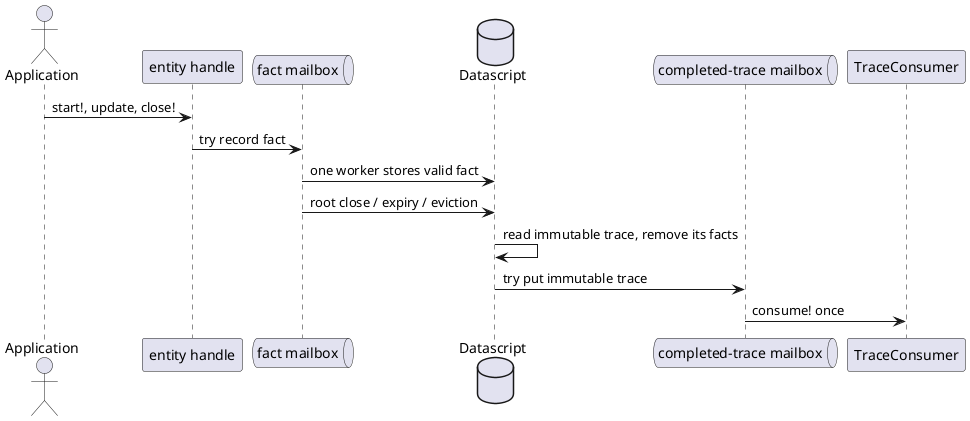

# Centralized Best-Effort Trace Recording

## Purpose

Trace collection is an observability service, not application state. It may
lose facts and complete traces. It must not make application work wait, throw
operational failures into application control flow, deadlock, or create
unbounded trace-owned queues, threads, or retained traces.

The design replaces distributed mutable state across root, child, and
grandchild handles with one Datascript fact store per `TraceRecorder`. The
process-wide default recorder is the convenient normal choice; callers may
create independent recorders, for example to isolate tests. AWS X-Ray is
outside that state-management boundary.

## Public Model

`start!` returns an immutable entity handle. A root handle contains a fresh
trace CUID; a child handle contains a fresh entity CUID and its parent's CUID.
No handle exposes a Datascript EID, mutable open/closed flag, `:done`, or a
send result.

Every public trace operation makes one non-blocking attempt to record a fact:

| Operation | Fact |
| --- | --- |
| root `start!` | `:root-started` |
| child `start!` | `:child-started` |
| `set-annotation!` | `:annotation-set` |
| `set-metadata!` | `:metadata-set` |
| `set-exception!` | `:exception-set` |
| `close!` | `:entity-closed` |

If the fact mailbox is full or unavailable, the operation returns normally and
the fact is lost. This includes a root start: its returned handle is then a
harmless no-op handle. Facts after root close may be stored or discarded
according to mailbox order; neither outcome is observable by application code.

`close!` means only that the caller has finished observing the entity. It does
not mean that a trace was stored, delivered to a consumer, or sent to X-Ray.

## IDs and Facts

Trace identity is independent of AWS identity.

```clojure
{:trace-key     <root-cuid>
 :entity-key    <cuid>
 :parent-key    <cuid-or-nil>
 :trace-id      <aws-xray-trace-id-or-nil>
 :parent-id     <aws-xray-parent-id-or-nil>}
```

`trace-key`, `entity-key`, and `parent-key` are internal CUIDs. The root has
`entity-key = trace-key`. `:trace-id` and `:parent-id` retain their AWS X-Ray
propagation meaning, but never take part in internal identity or Datascript
links.

A root-start fact also contains the `TraceConsumer` chosen by the caller.
That reference is retained only while the root's facts or its completed trace
are inside the fixed-capacity trace subsystem.

Facts are not an audit log. Datascript contains only facts needed to create one
completed immutable trace value.

## Central Fact Recording

Each `TraceRecorder` has one trace subsystem:

- one bounded fact mailbox;
- one worker which is the only writer to its Datascript connection;
- a bounded mechanism for expiring roots that were never closed;
- one bounded completed-trace mailbox and a fixed number of consumer calls.

The fact worker processes mailbox order. A child-start fact is stored only if
its parent is already stored for the same trace. Annotation, metadata,
exception, and close facts are stored only for an existing entity in that
trace. All other facts are discarded.

When the worker processes root close, expiry, or capacity eviction, it reads
all facts belonging to that root as an immutable trace value and removes the
whole trace from Datascript in the same worker turn. It then makes one
non-blocking attempt to put that value on the completed-trace mailbox. If that
mailbox is full, the completed trace is discarded.



## `TraceConsumer`

The external boundary is intentionally minimal:

```clojure
(defprotocol TraceConsumer
  (consume! [consumer trace]))
```

`consume!` receives an immutable completed trace. It may persist, transform,
send, or discard it. Its return value is ignored. An exception is caught. A
consumer may block, but it can occupy only one fixed consumer-call
slot; when those slots and the completed-trace mailbox are full, later traces
are dropped.

The core library never reports a consumer result and never waits for one. A
consumer that needs retries, delivery acknowledgement, or its own shutdown
contract owns those features itself.

## AWS X-Ray Integration

The core namespace does not import or construct `AWSXRayRecorder`.

The AWS X-Ray namespace provides:

- `xray-trace-consumer`, a factory helper for an `AWSXRayRecorder` configured
  with emitter, plugins, and sampling options;
- an `extend-protocol` implementation of `TraceConsumer` for
  `AWSXRayRecorder`; it translates the immutable trace into X-Ray segment and
  subsegment objects when `consume!` is called;
- `CapturedTraceConsumer`, a test double that retains received immutable trace
  values for assertions.

This works because the library owns `TraceConsumer`; extending that protocol
to a common external type is the supported Clojure extension model. The AWS
recorder's construction, configuration, and I/O behaviour remain at this
outer boundary.

## Resource Policy

All limits owned by a `TraceRecorder` are finite. The default recorder has
finite defaults. Independently created recorders own their own limits and must
be shut down by their owner.

| Resource | On exhaustion |
| --- | --- |
| Fact mailbox | Drop the attempted fact. |
| Stored roots | Drop a new root-start fact, or evict whole existing traces. |
| Entities per trace | Drop the child-start fact and facts requiring that child. |
| Total stored entities | Evict whole traces, then drop the attempted fact if still full. |
| Root lifetime | Remove the whole trace and attempt completed-trace delivery. |
| Completed-trace mailbox | Drop the completed trace. |
| Consumer-call slots | Keep queued completed traces only up to mailbox capacity; then drop them. |

These are bounds on resources owned by trace coordination. The library does
not impose size or shape limits on application values supplied as metadata,
annotations, or exceptions; callers remain responsible for those values.

`shutdown!` is idempotent. Without an argument it stops the process-wide
default recorder; with a `TraceRecorder` it stops that recorder. It rejects new
facts, drops queued facts and completed traces, removes stored facts, and
interrupts trace-owned workers without waiting for a consumer that ignores
interruption. It is distinct from entity `close!`.

## Required Properties

Tests must establish the following:

- only the fact worker mutates Datascript;
- one stored entity CUID belongs to one trace, and every non-root stored entity
  has a stored ancestor chain to that trace's root;
- root close, expiry, and eviction remove all facts belonging to that root;
- a completed trace is offered to its consumer at most once;
- application trace operations neither wait for capacity nor surface fact,
  consumer, or X-Ray failures;
- mailbox depth, stored roots, stored entities, consumer-call slots, and
  trace-owned worker count never exceed configured limits;
- a blocking or throwing consumer cannot block fact recording or application
  work.

## Verification

1. Unit-test fact acceptance, ancestry, root removal, capacity eviction, and
   CUID identity using a `CapturedTraceConsumer`.
2. Add deterministic concurrency tests with a controllable clock, mailbox,
   and blocking consumer. Exercise root close, child/grandchild creation,
   update, expiry, eviction, consumer failure, and consumer saturation.
3. Keep a bounded `test.check` property varying fan-out, depth, close order,
   delays, and configured capacities. It asserts termination and resource
   bounds, never trace completeness.
4. Run the CircleCI-equivalent coverage command repeatedly after the above
   tests pass.

## Major-Version Migration

This is intentionally breaking.

- `core/recorder` and `core/global-recorder` are removed from the core API.
- `core/start!` takes a `TraceConsumer` for roots; children derive that choice
  from their parent handle.
- `:eid`, `:done`, and send-result fields disappear from entity handles.
- Code which needs AWS X-Ray uses `xray-trace-consumer`; code which needs a
  test double uses `CapturedTraceConsumer`.
- Synchronous `core/with-open` and asynchronous `promise/with-open` retain
  their lexical close behaviour. `promise/with-open` must not create common
  `ForkJoinPool` work merely to close trace entities.

## Non-Goals

- Guaranteed trace storage, delivery, or AWS X-Ray emission.
- A public completion signal for internal trace cleanup or consumer I/O.
- Per-trace Datascript connections, mailboxes, timers, workers, retries, or
  finalizers.
- Wrapping the full `AWSXRayRecorder` configuration or lifecycle API.
- Making tracing a prerequisite for application success.
